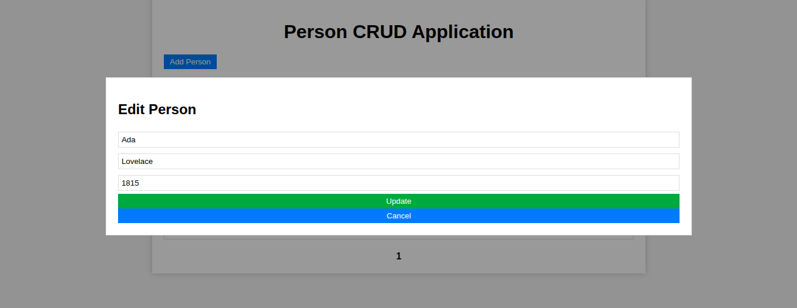

###JBang

[How to Build a Spring Boot Monolith with JBang](https://www.makariev.com/blog/how-to-build-spring-boot-monolith-with-jbang/)

В этом посте мы расскажем о том, как создать полноценное монолитное приложение на Spring Boot, 
реализующее операции CRUD (создание, чтение, обновление, удаление) для объекта Person. 
Мы будем использовать JPA для сохранения данных, Swagger для документации по API, 
Postgres в качестве базы данных и Vue.js 3 для фронтенда. Все это будет реализовано с помощью простого фреймворка JBang в одном файле на Java!

JBang — это CLI-утилита, которая позволяет запускать Java-код прямо из файла, 
без сложной структуры проекта, файлов сборки (Maven/Gradle) и явного объявления pom.xml. 

Все Java классы в одном файле springbootJpaVue.java.

Запуск:

````shell
jbang -Dspring.datasource.url=jdbc:h2:mem:person-db  springbootJpaVue.java
````




[http://localhost:8080/](http://localhost:8080/)
[http://localhost:8080/api/persons](http://localhost:8080/api/persons)

[http://localhost:8080/hi](http://localhost:8080/hi)
[http://localhost:8080/hi?name=aaa](http://localhost:8080/hi?name=aaa)

##Dependencies

Версия Java и dependencies указаны в начале java файла:

//JAVA 21
//DEPS org.springframework.boot:spring-boot-dependencies:3.3.0@pom
//DEPS org.springframework.boot:spring-boot-starter-web
//DEPS org.springframework.boot:spring-boot-starter-data-jpa
//DEPS org.springframework.boot:spring-boot-starter-actuator
//DEPS com.h2database:h2
//DEPS org.postgresql:postgresql
//DEPS org.projectlombok:lombok
//DEPS org.springdoc:springdoc-openapi-starter-webmvc-ui:2.5.0
//DEPS org.slf4j:slf4j-simple

//JAVA_OPTIONS -Dserver.port=8080
//JAVA_OPTIONS -Dspring.datasource.url=jdbc:h2:mem:person-db;MODE=PostgreSQL;
//JAVA_OPTIONS -Dspring.h2.console.enabled=true -Dspring.h2.console.settings.web-allow-others=true
//JAVA_OPTIONS -Dmanagement.endpoints.web.exposure.include=health,env,loggers
//FILES META-INF/resources/index.html=index-fetch.html

//REPOS mavencentral,sb_snapshot=https://repo.spring.io/snapshot,sb_milestone=https://repo.spring.io/milestone

